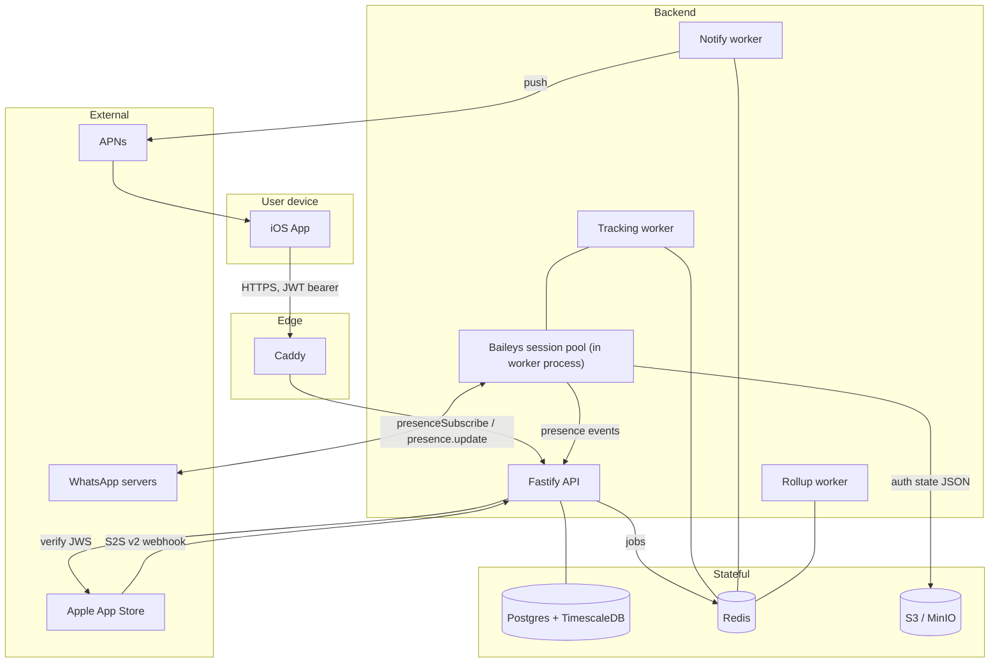
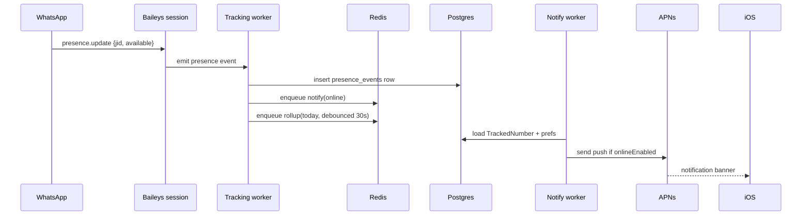
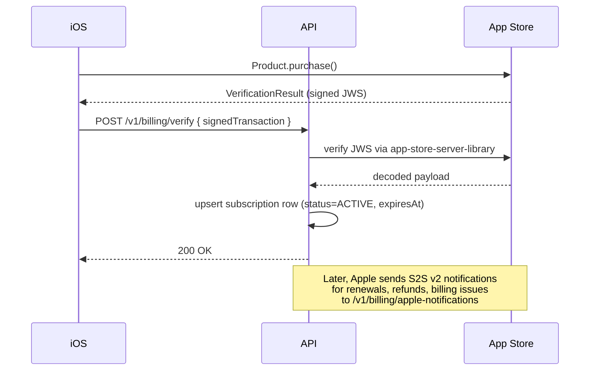

# Architecture

End-to-end picture of LastSeen.

## Process boundaries

There are two long-running Node processes:

1. **API** (`src/api/server.ts`) — stateless HTTP server. Horizontally scalable. All Baileys session state lives in S3, so any API instance can serve any request.
2. **Worker** (`src/workers/index.ts`) — runs the BullMQ workers AND owns the in-process Baileys session pool. Currently a single instance; not horizontally safe yet because the in-memory session map would need a coordinator (Redis lock or sharded queues by scraper id).

When we scale workers, the path forward is one worker per scraper, with each worker subscribed to a scraper-specific queue.

## Data flow: a tracked number coming online

## Data flow: subscription purchase

